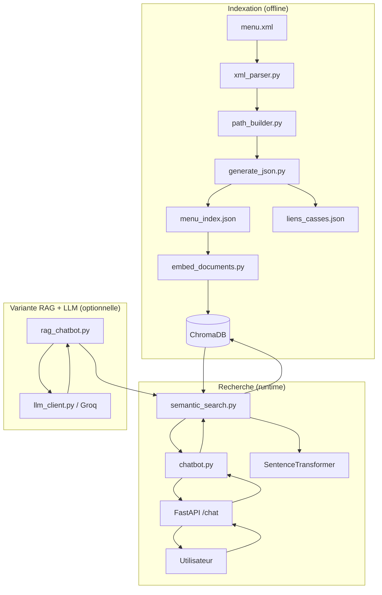

# Architecture du projet

Ce document complete le README avec le detail des choix techniques,
utile pour la revue de code et la soutenance.

## Vue d'ensemble

## Modules et responsabilites

| Module | Role | Depend de |
|---|---|---|
| `src/extraction/xml_parser.py` | Lit `menu.xml`, retourne `(main_menu, menus)` | - |
| `src/extraction/path_builder.py` | Parcourt le graphe et reconstruit les chemins complets (DFS depuis la racine) | `xml_parser` |
| `src/extraction/generate_json.py` | Serialise les chemins + le rapport d'anomalies en JSON | `path_builder` |
| `src/embedding/model.py` | Charge le modele SentenceTransformer (singleton, cache) | - |
| `src/embedding/embed_documents.py` | Encode chaque chemin et l'insere dans ChromaDB | `model`, `chroma_manager` |
| `src/database/chroma_manager.py` | Point d'acces unique a ChromaDB (client, collection, reset) | - |
| `src/search/semantic_search.py` | Encode une question et retourne le Top-K des chemins les plus proches | `model`, `chroma_manager` |
| `src/chatbot/chatbot.py` | Decide du type de reponse (directe / ambigue / aucun resultat) selon les seuils de distance | `semantic_search` |
| `src/generation/llm_client.py` | Wrapper autour de l'API Groq | - |
| `src/generation/rag_chatbot.py` | Variante RAG : retrieval + redaction par le LLM | `semantic_search`, `llm_client` |
| `src/api/app.py` | Expose `/chat` et `/health` via FastAPI | `chatbot` |
| `src/ui/app.py` | Interface de demo Streamlit (mode direct ou RAG) | `chatbot`, `rag_chatbot` |

## Pourquoi ces choix

- **ChromaDB en local (persistant, sans serveur)** : suffisant pour ~1400
  documents, evite une dependance a un service externe pour un POC
  interne.
- **`paraphrase-multilingual-MiniLM-L12-v2`** : modele leger (~470 Mo),
  tourne sur CPU, supporte le francais — pas besoin de GPU pour ce
  volume de donnees.
- **Deux modes de reponse (`chatbot.py` vs `rag_chatbot.py`)** : le mode
  direct est deterministe et rapide (pas d'appel LLM), utile en
  production ; le mode RAG sert de demonstrateur pour montrer une
  reponse redigee en langage naturel, avec citation stricte des
  chemins source pour eviter les hallucinations.
- **Seuils de distance cosinus empiriques** (`SEUIL_CONFIANT = 0.30`,
  `SEUIL_INCERTAIN = 0.55`, `ECART_AMBIGUITE = 0.05`) : a ajuster selon
  les retours utilisateurs reels ; documentes dans le docstring de
  `chatbot.py`.

## Limites connues / pistes d'amelioration

- Les seuils de confiance sont fixes empiriquement, pas encore valides
  sur un jeu de questions reelles d'utilisateurs.
- Pas de gestion de synonymes/abreviations metier (ex. "RO", "RC") au-
  dela de ce que le modele d'embeddings capture nativement.
- L'alternative "Classical RAG" (Meilisearch + Ollama/Phi-4-mini, sans
  GPU) a ete etudiee mais n'est pas encore implementee dans ce depot.
- Pas encore de mecanisme de log/feedback pour capitaliser sur les
  questions mal repondues.
