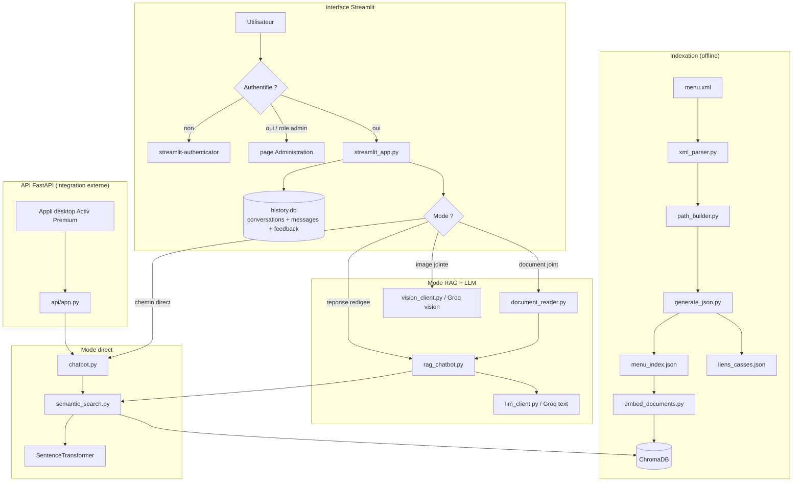

# Architecture du projet

Ce document complete le README avec le detail des choix techniques,
utile pour la revue de code et la soutenance.

## Vue d'ensemble

```mermaid
flowchart TD
    subgraph Offline["Indexation (offline)"]
        XML[menu.xml] --> P1[xml_parser.py]
        P1 --> P2[path_builder.py]
        P2 --> P3[generate_json.py]
        P3 --> IDX[menu_index.json]
        P3 --> BROKEN[liens_casses.json]
        IDX --> EMB[embed_documents.py]
        EMB --> CHROMA[(ChromaDB)]
    end

    subgraph UI["Interface Streamlit"]
        USER[Utilisateur] --> AUTH{Authentifie ?}
        AUTH -- non --> LOGIN[streamlit-authenticator]
        AUTH -- oui / role admin --> ADMIN[page Administration]
        AUTH -- oui --> CHAT[streamlit_app.py]
        CHAT --> HIST[(history.db\nconversations + messages + feedback)]
        CHAT --> MODE{Mode ?}
    end

    subgraph Direct["Mode direct"]
        MODE -- chemin direct --> BOT[chatbot.py]
        BOT --> SEARCH[semantic_search.py]
        SEARCH --> MODEL[SentenceTransformer]
        SEARCH --> CHROMA
    end

    subgraph RAG["Mode RAG + LLM"]
        MODE -- reponse redigee --> BOT2[rag_chatbot.py]
        BOT2 --> SEARCH
        BOT2 --> LLM[llm_client.py / Groq text]
        MODE -- image jointe --> VISION[vision_client.py / Groq vision]
        MODE -- document joint --> DOC[document_reader.py]
        DOC --> BOT2
    end

    subgraph API["API FastAPI (integration externe)"]
        EXT[Appli desktop Activ Premium] --> FASTAPI[api/app.py]
        FASTAPI --> BOT
    end
```

## Modules et responsabilites

| Module | Role | Depend de |
|---|---|---|
| `src/extraction/xml_parser.py` | Lit `menu.xml`, retourne `(main_menu, menus)` | - |
| `src/extraction/path_builder.py` | Parcourt le graphe et reconstruit les chemins complets (DFS depuis la racine) | `xml_parser` |
| `src/extraction/generate_json.py` | Serialise les chemins + le rapport d'anomalies en JSON | `path_builder` |
| `src/embedding/model.py` | Charge le modele SentenceTransformer (singleton, cache) | - |
| `src/embedding/embed_documents.py` | Encode chaque chemin et l'insere dans ChromaDB | `model`, `chroma_manager` |
| `src/database/chroma_manager.py` | Point d'acces unique a ChromaDB (client, collection, reset) | - |
| `src/database/history_manager.py` | Historique SQLite : conversations, messages, feedback | - |
| `src/search/semantic_search.py` | Encode une question et retourne le Top-K des chemins les plus proches | `model`, `chroma_manager` |
| `src/chatbot/chatbot.py` | Decide du type de reponse (directe / ambigue / aucun resultat) selon les seuils de distance | `semantic_search`, `config` |
| `src/generation/llm_client.py` | Wrapper autour de l'API Groq (texte) | - |
| `src/generation/vision_client.py` | Wrapper autour de l'API Groq (vision, analyse d'image) | - |
| `src/generation/rag_chatbot.py` | Variante RAG : retrieval + redaction par le LLM, contexte document optionnel | `semantic_search`, `llm_client`, `config` |
| `src/files/document_reader.py` | Extrait le texte d'un fichier uploade (PDF/Excel/CSV/code) | - |
| `src/admin/user_manager.py` | CRUD utilisateurs sur `auth_config.yaml` (creation, reset mdp, roles) | - |
| `src/api/app.py` | Expose `/chat` et `/health` via FastAPI (pour integration externe) | `chatbot` |
| `src/ui/streamlit_app.py` | Interface de chat (auth, historique, upload, feedback) | `chatbot`, `rag_chatbot`, `history_manager` |
| `src/ui/pages/1_Administration.py` | Page reservee aux admins (gestion des utilisateurs) | `user_manager` |

## Pourquoi ces choix

- **ChromaDB en local (persistant, sans serveur)** : suffisant pour ~1400
  documents, evite une dependance a un service externe pour un POC
  interne.
- **`paraphrase-multilingual-MiniLM-L12-v2`** : modele leger (~470 Mo),
  tourne sur CPU, supporte le francais — pas besoin de GPU pour ce
  volume de donnees.
- **Deux modes de reponse (`chatbot.py` vs `rag_chatbot.py`)** : le mode
  direct est deterministe et rapide (pas d'appel LLM), utile en
  production ; le mode RAG sert de demonstrateur pour montrer une
  reponse redigee en langage naturel, avec citation stricte des
  chemins source pour eviter les hallucinations.
- **Seuils de distance cosinus centralises dans `src/config.py`**
  (`SEUIL_DISTANCE_CONFIANT = 0.30`, `SEUIL_DISTANCE_FIABLE = 0.55`,
  `ECART_AMBIGUITE = 0.05`) : utilises a la fois par `chatbot.py` et
  `rag_chatbot.py`, pour garantir que les deux modes soient d'accord
  sur ce qui est "fiable" ou non (auparavant deux valeurs differentes
  et non comparables etaient codees en dur separement, source
  d'incoherences entre les deux modes).
- **Modeles Groq configurables via `.env`** (`GROQ_MODEL`,
  `GROQ_VISION_MODEL`) plutot que codes en dur : les modeles disponibles
  chez Groq changent regulierement (deprecation), un changement de
  variable d'environnement suffit alors, sans toucher au code.
- **SQLite pour l'historique et l'authentification** : pas de serveur de
  base de donnees a gerer, suffisant pour un usage interne a l'echelle
  d'une equipe.
- **Streamlit multipage (`src/ui/pages/`)** pour la page Administration :
  isole les operations sensibles (gestion des utilisateurs) de
  l'interface de chat principale, tout en partageant la meme session
  authentifiee (cookie).

## Securite

- Les mots de passe sont hashes (bcrypt, via `streamlit-authenticator`),
  jamais stockes en clair.
- `config/auth_config.yaml` (credentials) et `.env` (cle API) sont
  exclus du controle de version via `.gitignore`.
- La page Administration verifie le role (`admin`) a chaque chargement,
  independamment de la page principale (relecture du cookie de session).
- Un utilisateur admin ne peut ni se supprimer lui-meme, ni se retirer
  ses propres droits admin (protection contre l'auto-verrouillage).

## Limites connues / pistes d'amelioration

- Les seuils de confiance sont fixes empiriquement, pas encore valides
  par une metrique chiffree sur un jeu de questions reelles
  d'utilisateurs (voir `notebooks/evaluation_recherche_semantique.ipynb`).
- Pas de gestion de synonymes/abreviations metier (ex. "RO", "RC") au-
  dela de ce que le modele d'embeddings capture nativement.
- L'alternative "Classical RAG" (Meilisearch + Ollama/Phi-4-mini, sans
  GPU) a ete etudiee mais n'est pas encore implementee dans ce depot.
- Le feedback 👍/👎 est stocke mais pas encore exploite (pas de tableau
  de bord dans la page Administration pour visualiser les questions mal
  notees — la fonction `get_stats_feedback()` existe deja cote backend).
- Pas de logs structures (`print()` utilise dans les scripts offline) :
  suffisant pour un POC, a remplacer par `logging` avant une mise en
  production plus large.